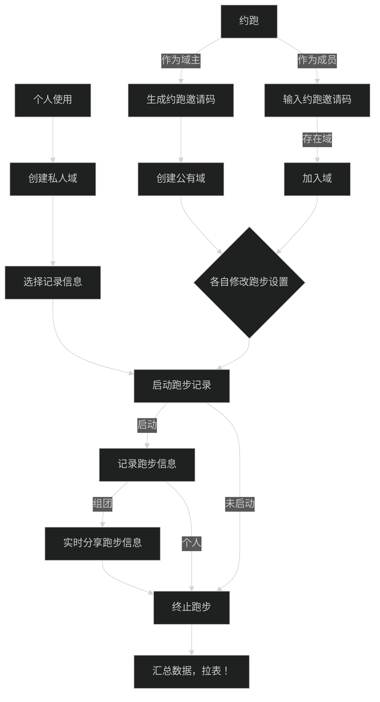
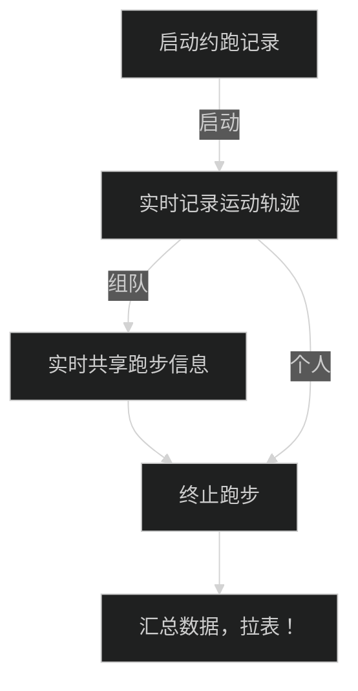
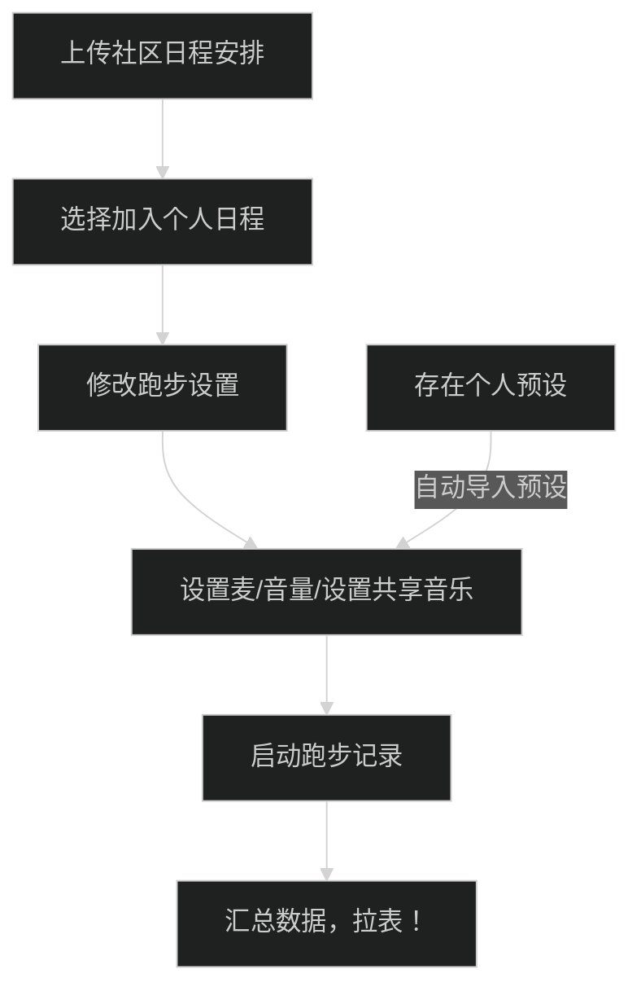
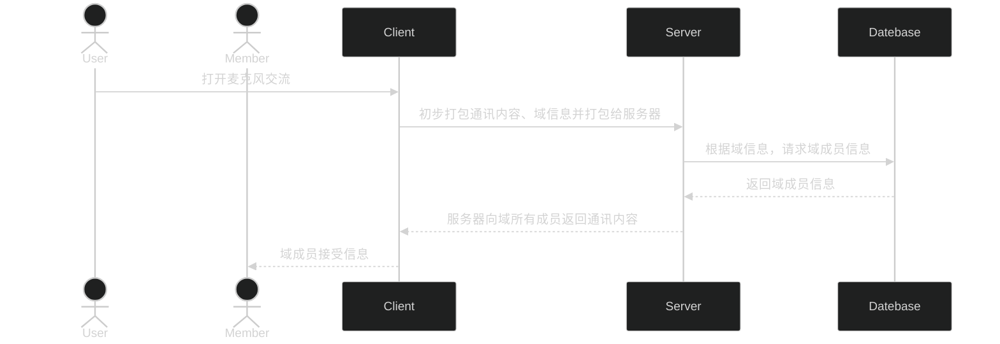
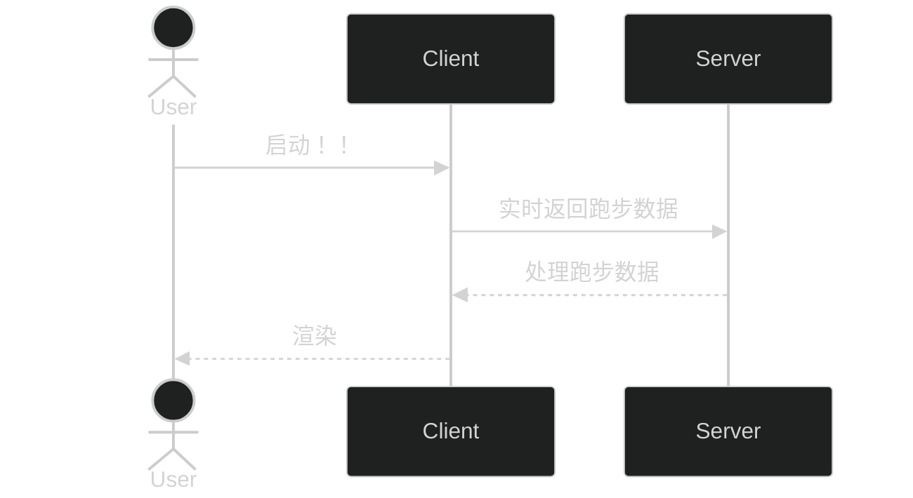
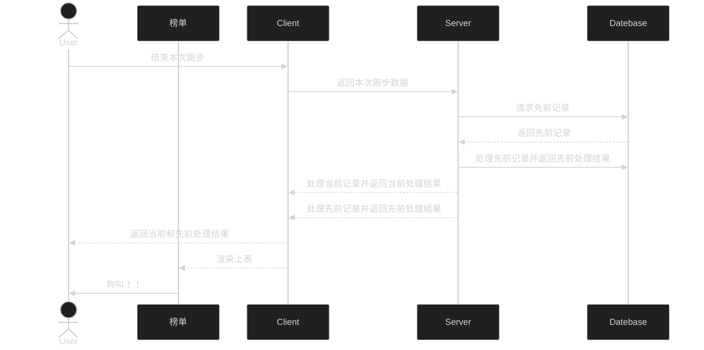
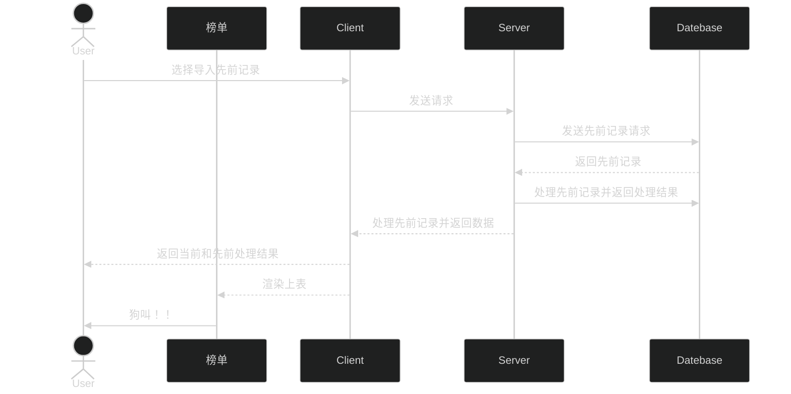
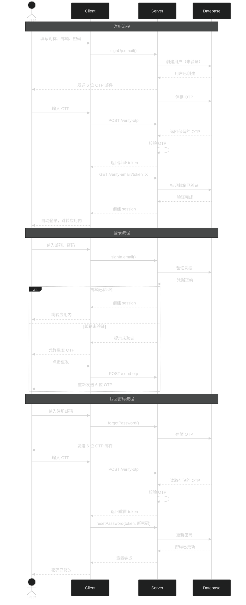

# 核心程序

---

## Runner 主流程

1. 域永久存在，可主动删除

---

## 个人设置

1. 基础信息
2. 跑步预设（音频）
3. 个人日程表
4. 第三方关联

---

## 跑步记录

---

## 社区（域？）系统

### 主要流程

### 语音系统

---

## 轨迹测绘

1. 用户可自行选择测绘密度

---

## 数据汇总与拉表

### 本次记录

### 导入先前记录（暂定）

---

## 登录

基于邮箱密码 + OTP 验证码的认证体系（better-auth）。

---

## 微信

- [ ] 添加微信登录
- [ ] 添加微信分享
- [ ] 添加微信运动 SDK

---

## 其他运动设备

- [ ] 添加第三方运动数据收集流程
