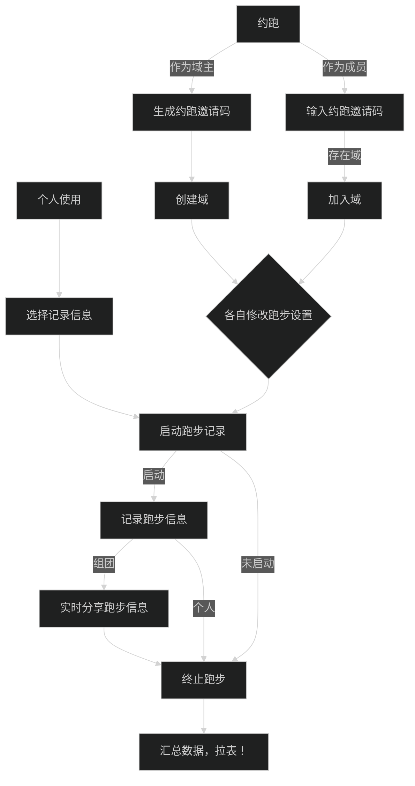
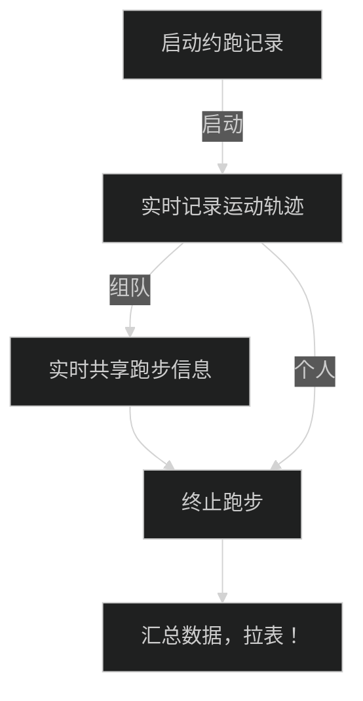
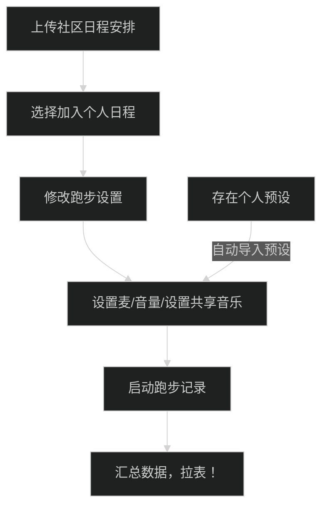
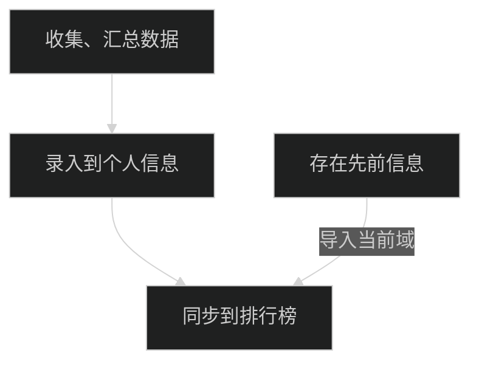

# 核心程序

---

## Runner 主流程

1. 域永久存在，可主动删除

---

## 个人设置

1. 基础信息
2. 跑步预设（音频）
3. 个人日程表
4. 第三方关联

---

## 跑步记录

---

## 社区（域？）系统

---

## 数据汇总与拉表

---

## 微信

- [ ] 添加微信登录
- [ ] 添加微信分享
- [ ] 添加微信运动 SDK

---

## 其他运动设备

- [ ] 添加第三方运动数据收集流程
