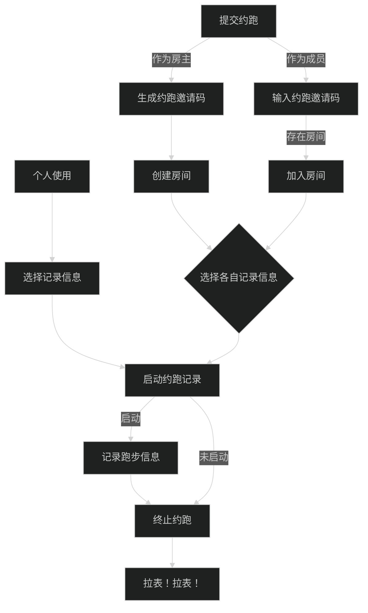
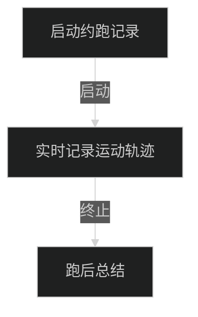

# 核心程序

## Runner 主流程

```mermaid
%%{init: {'theme': 'dark'}}%%
graph TD
a[个人使用]
b[选择记录信息]
A[提交约跑]
B[生成约跑邀请码]
C[输入约跑邀请码]
D[创建房间]
E[加入房间]
F{选择各自记录信息}
G[启动约跑记录]
H[记录跑步信息]
I[终止约跑]
J[拉表！拉表！]

A-->|作为房主|B-->D-->F
A-->|作为成员|C-->|存在房间|E-->F

a-->b-->G

F-->G

G-->|启动|H-->I
G-->|未启动|I

I-->J
```

## 约跑记录

```mermaid
%%{init: {'theme': 'dark'}}%%
graph TD
A[启动约跑记录]
B[实时记录运动轨迹]
C[跑后总结]

A-->|启动|B-->|终止|C
```

---

## 微信

- [ ] 添加微信登录
- [ ] 添加微信分享
- [ ] 添加微信运动 SDK

---

## 链接其他运动设备

- [ ] 添加第三方运动数据收集流程
